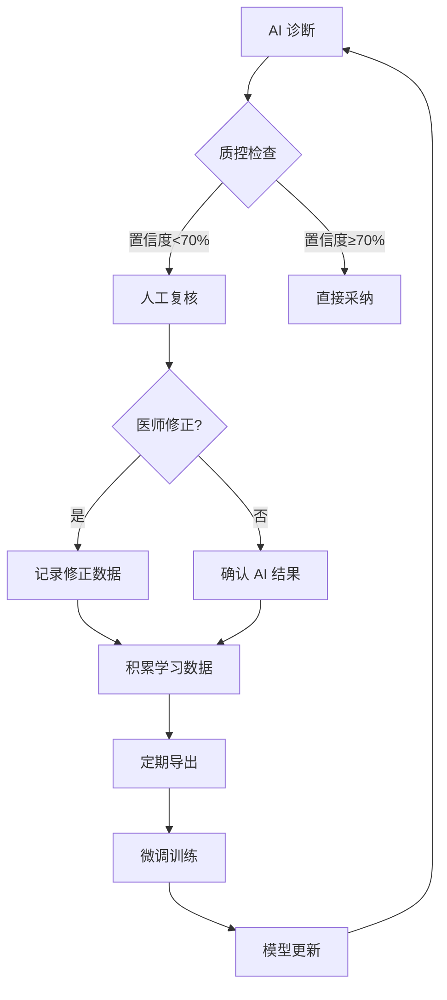

# 高级诊断功能增强实现文档

## 概述

本次更新实现了四大改进方向，显著提升乳腺超声 AI 辅助诊断系统的临床实用性和安全性。

---

## 1️⃣ 可视化增强

### 实现文件
- `/app/diagnosis/services/visualization_enhancement.py`

### 核心功能

#### 1.1 病灶标注
```python
# 边界框绘制 (根据 BI-RADS 分级自动着色)
viz_service.draw_bounding_box(
    image=image,
    bbox={'x': 150, 'y': 200, 'width': 25, 'height': 30},
    label="BI-RADS 4B",
    color=(255, 0, 0),  # 红色
    thickness=3
)
```

**BI-RADS 配色方案**:
- BI-RADS 1-2: 🟢 绿色 (良性)
- BI-RADS 3: 🔵 青色 (可能良性)
- BI-RADS 4A: 🟡 黄色 (低度可疑)
- BI-RADS 4B: 🟠 橙色 (中度可疑)
- BI-RADS 4C-5: 🔴 红色 (高度可疑)

#### 1.2 AI 注意力热图
```python
# 叠加 AI 注意力热图 (显示 AI 关注的区域)
viz_service.draw_heatmap(
    image=image,
    heatmap_data=ai_attention_map,  # 0-1 浮点数组
    alpha=0.6,
    colormap='jet'  # jet/hot/cool
)
```

**作用**: 医生可直观看到 AI 模型关注的区域，增强信任度

#### 1.3 分割掩码叠加
```python
# 半透明病灶区域标注
viz_service.draw_segmentation_mask(
    image=image,
    mask=segmentation_mask,  # 二值图
    color=(0, 255, 0),  # 绿色
    alpha=0.4
)
```

**优势**: 精确显示病灶边界，便于测量和定位

#### 1.4 测量标注
```python
# 自动标注测量结果
measurements = [
    Measurement(
        label="长径",
        value=2.5,
        unit="cm",
        start_point=(150, 200),
        end_point=(175, 200)
    ),
    Measurement(
        label="宽",
        value=3.0,
        unit="cm",
        start_point=(150, 200),
        end_point=(150, 230)
    ),
]
viz_service.draw_measurements(image, measurements)
```

**显示**: 黄色测量线 + 青色端点 + 文字标注

#### 1.5 AI 置信度指示器
```python
# 在图像上显示 AI 置信度条
viz_service.draw_ai_confidence(
    image=image,
    confidence=0.87,
    threshold=0.7
)
```

**提示**:
- ≥90%: 高置信度 ✅
- 70-90%: 中等置信度 ⚠️
- <70%: 低置信度 - 建议人工复核 🔴

#### 1.6 多模态综合标注
```python
# 一站式叠加所有标注
annotated_image = viz_service.draw_multimodal_overlay(
    image=raw_image,
    bbox=bbox,
    mask=mask,
    heatmap=heatmap,
    measurements=measurements,
    birads_category="4B",
    ai_confidence=0.87
)
```

### API 端点
```http
POST /api/v1/diagnosis/advanced/annotate-image
Content-Type: application/json

{
  "image_urls": ["http://.../image.jpg"],
  "patient_info": {"age": 45, "gender": "female"}
}

Response:
{
  "image_data": "data:image/jpeg;base64,...",
  "annotations": {
    "bbox": {...},
    "measurements": [...],
    "birads_category": "4B",
    "ai_confidence": 0.87
  }
}
```

---

## 2️⃣ 质控机制

### 实现文件
- `/app/diagnosis/services/quality_control.py`

### 核心功能

#### 2.1 AI 置信度评估
```python
qc_manager = QualityControlManager(auto_review_threshold=0.7)

quality_metrics = qc_manager.evaluate_confidence(
    ai_result=ai_result,
    ultrasound_features=features
)

# 评估维度:
# - overall_confidence: 整体置信度
# - feature_confidence: 各征象置信度
# - consistency_score: 征象一致性
# - uncertainty_level: 不确定性
```

**评分逻辑**:
1. AI 模型输出置信度
2. 征象矛盾检测 (如"无回声"+"丰富血流")
3. 图像质量评分
4. 综合计算最终置信度

#### 2.2 必须复核的关键征象
```python
MANDATORY_REVIEW_FEATURES = {
    'taller_than_wide': "纵横比>1",
    'spiculated_margin': "毛刺状边缘",
    'microlobulated_margin': "微小分叶",
    'fine_calcification': "细小钙化",
    'posterior_shadowing': "后方回声衰减",
}
```

**规则**: 检测到任一关键征象 → 自动触发人工复核

#### 2.3 征象一致性检查
```python
CONSISTENCY_RULES = {
    # 如果形状不规则，边缘通常也不清晰
    ('irregular_shape', 'indistinct_margin'): 0.8,
    # 如果是囊性，后方通常增强
    ('anechoic', 'posterior_enhancement'): 0.9,
    # 如果血流丰富，通常不是良性
    ('rich_vascularity', 'no_vascularity'): 0.1,
}
```

**检测**: 违反一致性规则 → 降低一致性评分 → 触发复核

#### 2.4 自动复核工作流
```python
# 状态流转
待复核 (pending) → 复核中 (in_review) → 已确认/已修改/已拒绝

workflow = ReviewWorkflow(qc_manager)

# 提交复核
workflow.submit_for_review(
    diagnosis_id=123,
    ai_result=ai_result,
    reason="低置信度预警"
)

# 分配医师
workflow.assign_reviewer(
    diagnosis_id=123,
    reviewer_id=456
)

# 完成复核
workflow.complete_review(
    diagnosis_id=123,
    modified_result=corrected_result,
    comments="修正边缘描述"
)
```

#### 2.5 持续学习数据收集
```python
# 导出所有医师修正数据
learning_data = qc_manager.get_learning_dataset()

# 数据结构:
{
  "diagnosis_id": 123,
  "original_prediction": {...},  # AI 原始预测
  "corrected_prediction": {...}, # 医师修正
  "confidence_delta": 0.15,      # 置信度变化
  "reviewer_id": 456,
  "comments": "修正为 BI-RADS 4B"
}

# 导出为训练数据
qc_manager.export_training_data(
    output_path="training_data.jsonl",
    format="jsonl"
)
```

### API 端点

#### 质控评估
```http
POST /api/v1/diagnosis/advanced/quality-check

Response:
{
  "quality_metrics": {
    "overall_confidence": 0.82,
    "feature_confidence": {"margin": 0.75, ...},
    "consistency_score": 0.88,
    "uncertainty_level": 0.18
  },
  "should_review": true,
  "review_reason": "检测到关键恶性征象：毛刺状边缘",
  "warning_level": "yellow",
  "recommendation": "⚠️ AI 置信度中等，建议人工复核确认"
}
```

#### 提交复核
```http
POST /api/v1/diagnosis/advanced/submit-for-review?diagnosis_id=123&reason=低置信度

Response:
{
  "status": "pending",
  "diagnosis_id": 123,
  "reason": "低置信度预警"
}
```

---

## 3️⃣ 工作流优化

### 实现文件
- `/app/diagnosis/services/workflow_optimizer.py`

### 核心功能

#### 3.1 历史检查一键对比
```python
optimizer = WorkflowOptimizer()

comparison = optimizer.compare_examinations(
    current_exam=current_exam,
    previous_exam=previous_exam,
    days_interval=180  # 间隔 6 个月
)
```

**对比内容**:
1. **大小变化**: 绝对值 (mm) / 百分比 (%)
2. **体积变化**: 基于椭球体公式计算
3. **生长速度**: mm/月
4. **倍增时间**: 基于指数生长模型
5. **BI-RADS 变化**: 升级/降级/无变化
6. **征象演变**: 新增征象 / 消失征象

**评估标准**:
```python
# RECIST 1.1 标准
- CR (完全缓解): 病灶消失
- PR (部分缓解): 缩小≥30%
- SD (疾病稳定): 介于-30% 到 +20% 之间
- PD (疾病进展): 增大≥20%
```

#### 3.2 智能随访计划生成
```python
plan = optimizer.generate_followup_plan(
    patient_id=123,
    lesion_id=456,
    birads_category="3",
    special_conditions={
        'growth_rate': 15,  # 15mm/月
        'doubling_time': 200  # 天
    }
)
```

**BI-RADS 基础间隔**:
| BI-RADS | 随访间隔 | 优先级 |
|---------|---------|--------|
| 1-2 | 12 个月 | ROUTINE |
| 3 | 6 个月 | SHORT_TERM |
| 4A | 2 个月 | URGENT |
| 4B-5 | 1 个月 | IMMEDIATE |

**动态调整**:
- 快速生长 (>20mm/月) → 缩短到 1 个月
- 短倍增时间 (<180 天) → 缩短到 2 个月
- 新征象出现 → 优先级别 +1

#### 3.3 随访提醒
```python
# 获取即将到期的随访
upcoming = optimizer.get_followup_reminders(days_ahead=7)

# 获取逾期随访
overdue = optimizer.get_overdue_followups(patient_id=123)

# 提醒设置:
# - 首次提醒：推荐日期前 7 天
# - 紧急提醒：最晚日期前 3 天
```

#### 3.4 生长曲线生成
```python
growth_curve_data = [
    {"date": "2026-01-01", "size_mm": 20},
    {"date": "2026-03-01", "size_mm": 22},
    {"date": "2026-06-01", "size_mm": 25}
]

# 前端可绘制折线图展示趋势
```

### API 端点

#### 历史对比
```http
POST /api/v1/diagnosis/advanced/compare-examinations

{
  "patient_id": 123,
  "lesion_id": 456,
  "current_exam_date": "2026-06-01",
  "previous_exam_date": "2026-01-01"
}

Response:
{
  "comparison_result": {
    "size_change": {"absolute_mm": 5, "percent": "25.0%"},
    "volume_change": {"percent": "95.3%"},
    "birads_change": "升级 3→4A (+1 级)",
    "new_features": ["不规则形", "纵横比>1"],
    "growth_rate": "2.50 mm/月",
    "doubling_time_days": "240 天",
    "assessment": "进展",
    "recommendation": "病灶进展，建议穿刺活检"
  },
  "growth_curve_data": [...]
}
```

#### 生成随访计划
```http
POST /api/v1/diagnosis/advanced/generate-followup-plan

{
  "patient_id": 123,
  "lesion_id": 456,
  "birads_category": "3"
}

Response:
{
  "plan_id": "FU20260601_123_456",
  "priority": "short",
  "recommended_date": "2026-12-01",
  "latest_date": "2026-12-16",
  "followup_type": "超声随访",
  "reason": "BI-RADS 3 类，短期随访观察稳定性"
}
```

#### 获取提醒
```http
GET /api/v1/diagnosis/advanced/followup-reminders?days_ahead=7

Response:
{
  "upcoming": [
    {
      "plan_id": "FU20260601_123_456",
      "recommended_date": "2026-12-01",
      "priority": "short",
      "followup_type": "超声随访"
    }
  ],
  "overdue": [...],
  "statistics": {
    "upcoming_count": 3,
    "overdue_count": 1
  }
}
```

---

## 4️⃣ 持续学习

### 数据收集机制

#### 4.1 医师修正记录
```python
# 每次人工复核都会记录
review_record = qc_manager.create_review_record(
    diagnosis_id=123,
    reviewer_id=456,
    original_result=ai_result,
    modified_result=corrected_result,
    comments="修正边缘为毛刺状"
)
```

#### 4.2 学习数据集生成
```python
# 收集所有修正案例
learning_data = [
  {
    "diagnosis_id": 123,
    "original_prediction": {
      "birads": "4A",
      "confidence": 0.65,
      "features": {"margin": "indistinct"}
    },
    "corrected_prediction": {
      "birads": "4B",
      "confidence": 0.85,
      "features": {"margin": "spiculated"}
    },
    "confidence_delta": 0.20,
    "reviewer_id": 456
  }
]
```

#### 4.3 导出训练数据
```bash
# 导出为 JSONL 格式 (适合微调训练)
curl -X POST "http://localhost:8005/api/v1/diagnosis/advanced/export-learning-data?format=jsonl" \
  -o training_data.jsonl
```

### 模型微调工作流



### 质量保证

#### 质控统计面板
```http
GET /api/v1/diagnosis/advanced/quality-statistics

Response:
{
  "statistics": {
    "total_reviews": 150,
    "confirmed_count": 120,
    "modified_count": 30,
    "average_confidence": 0.83,
    "review_rate": 0.25,
    "modification_rate": 0.20,
    "average_confidence_delta": 0.05
  },
  "quality_assessment": "良好",
  "recommendations": [
    "继续保持高置信度诊断",
    "修改率合理"
  ]
}
```

---

## 集成指南

### 1. 后端集成
```python
# app/main.py 已自动注册
from app.diagnosis.api.advanced_diagnosis_api import router

app.include_router(router)
```

### 2. 前端集成示例

#### 可视化标注
```typescript
// React 组件
const AnnotatedImageViewer = ({ imageUrl, aiResult }) => {
  const [annotatedImage, setAnnotatedImage] = useState(null);
  
  useEffect(() => {
    const annotate = async () => {
      const response = await fetch('/api/v1/diagnosis/advanced/annotate-image', {
        method: 'POST',
        body: JSON.stringify({
          image_urls: [imageUrl],
          ...aiResult
        })
      });
      const data = await response.json();
      setAnnotatedImage(data.image_data);
    };
    annotate();
  }, [imageUrl, aiResult]);
  
  return annotatedImage ?  : null;
};
```

#### 质控预警
```typescript
// AI 诊断结果展示时
const QualityWarning = ({ metrics }) => {
  const getColor = (level) => {
    switch(level) {
      case 'green': return '✅';
      case 'yellow': return '⚠️';
      case 'orange': return '🔶';
      case 'red': return '🔴';
    }
  };
  
  return (
    <div className={`alert-${metrics.warning_level}`}>
      {getColor(metrics.warning_level)}
      <span>{metrics.recommendation}</span>
    </div>
  );
};
```

#### 历史对比视图
```typescript
// 对比卡片
const ComparisonCard = ({ comparison }) => {
  return (
    <div className="comparison-card">
      <h3>病灶变化对比</h3>
      <div className="metric">
        <span>大小变化:</span>
        <span className={comparison.size_change_percent > 20 ? 'danger' : 'normal'}>
          {comparison.size_change_mm}mm ({comparison.size_change_percent}%)
        </span>
      </div>
      <div className="metric">
        <span>生长速度:</span>
        <span>{comparison.growth_rate}</span>
      </div>
      <div className="metric">
        <span>BI-RADS 变化:</span>
        <span>{comparison.birads_change}</span>
      </div>
      <div className="recommendation">
        {comparison.recommendation}
      </div>
    </div>
  );
};
```

---

## 测试验证

### 1. 启动服务
```bash
cd /workspace/breast-ai-system
python3 -m uvicorn app.main:app --host 0.0.0.0 --port 8005 --reload
```

### 2. 测试可视化标注
```bash
curl -X POST http://localhost:8005/api/v1/diagnosis/advanced/annotate-image \
  -H "Content-Type: application/json" \
  -d '{
    "image_urls": ["https://example.com/ultrasound.jpg"]
  }'
```

### 3. 测试质控评估
```bash
curl -X POST http://localhost:8005/api/v1/diagnosis/advanced/quality-check \
  -H "Content-Type: application/json" \
  -d '{
    "image_urls": [],
    "features": {
      "shape": "irregular",
      "margin_types": ["spiculated"],
      "taller_than_wide": true
    }
  }'
```

### 4. 测试历史对比
```bash
curl -X POST http://localhost:8005/api/v1/diagnosis/advanced/compare-examinations \
  -H "Content-Type: application/json" \
  -d '{
    "patient_id": 1,
    "lesion_id": 1,
    "current_exam_date": "2026-06-01",
    "previous_exam_date": "2026-01-01"
  }'
```

---

## 临床价值

### 1. 可视化增强
- ✅ **医生信任度提升**: 直观看到 AI 决策依据
- ✅ **诊断效率提升**: 自动标注节省手工测量时间
- ✅ **教学价值**: 清晰展示恶性征象

### 2. 质控机制
- ✅ **漏诊率降低**: 低置信度自动触发复核
- ✅ **一致性提升**: 标准化质控流程
- ✅ **持续改进**: 收集修正数据优化模型

### 3. 工作流优化
- ✅ **随访依从性提升**: 自动提醒减少逾期
- ✅ **治疗监测**: 客观评估治疗反应
- ✅ **医患沟通**: 生长曲线直观展示

### 4. 持续学习
- ✅ **模型进化**: 基于真实世界数据微调
- ✅ **个性化适配**: 适应本院患者特征
- ✅ **质控闭环**: 医师反馈→模型改进→质量提升

---

## 后续优化方向

1. **3D 可视化**: 支持三维超声的容积标注
2. **多模态融合**: MRI/ 钼靶/超声联合标注
3. **实时标注**: 超声设备直连实时 AI 分析
4. **联邦学习**: 多中心协作训练保护隐私
5. **可解释性增强**: Grad-CAM等可视化技术集成

---

## 附录：核心文件清单

```
/workspace/breast-ai-system/app/diagnosis/
├── services/
│   ├── visualization_enhancement.py   # 可视化增强服务
│   ├── quality_control.py             # 质控管理服务
│   └── workflow_optimizer.py          # 工作流优化服务
└── api/
    ├── advanced_diagnosis_api.py      # 高级功能 API
    └── __init__.py                     # 路由导出
```
